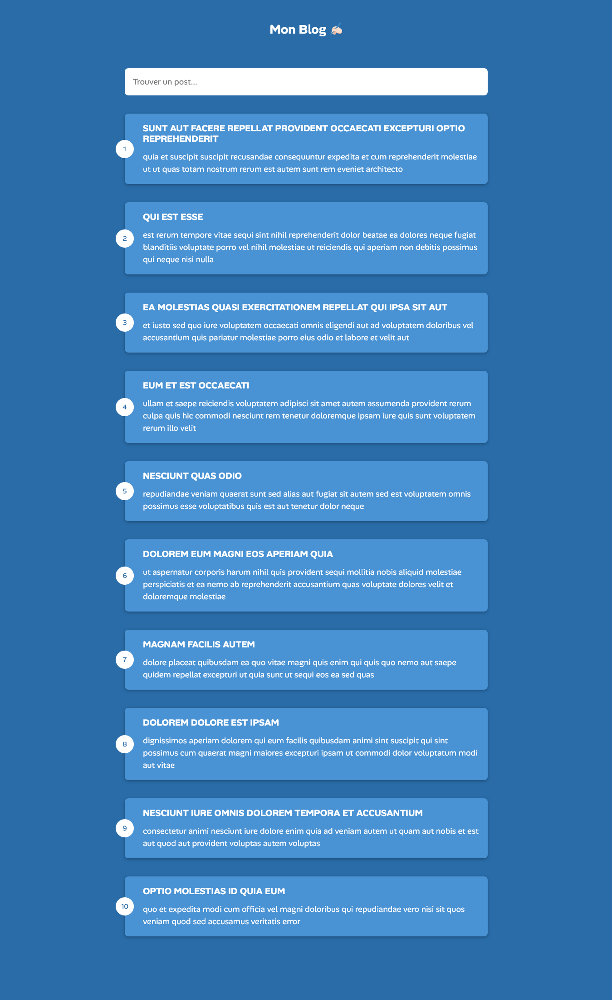

## MON BLOG ✍🏻

## Le challenge

Ce mini projet permet d'afficher les articles d'un blog depuis jsonplaceholder. Il permet un défilement infini des posts et contient également une zone de filtre afin de récupérer des articles en fonction des mots tapés dans le champs de saisie.

- Spécifications techniques :
  - Récupérer les publications initiales de l'API et les afficher
  - Scroll infini
  - Afficher le loader et récupérer la prochaine série de messages
  - Ajouter un filtrage sur les publications
  - page web responsive

## Démonstration

Lien vers le projet : https://aperbet56.github.io/my_blog/

## Projet développé avec

- Utilisation des balises sémantiques HTML5
- CSS3
- Flexbox
- Position absolute
- Position relative
- Desktop first
- Animation CSS
- Loader
- Utilisation d'un normaliseur : le fichier normalize.css
- Importation de la police "Alan Sans"
- Page web responsive
- Desktop first
- Commentaires HTML
- Commentaires CSS
- JavaScript
- Code JavaScript commenté
